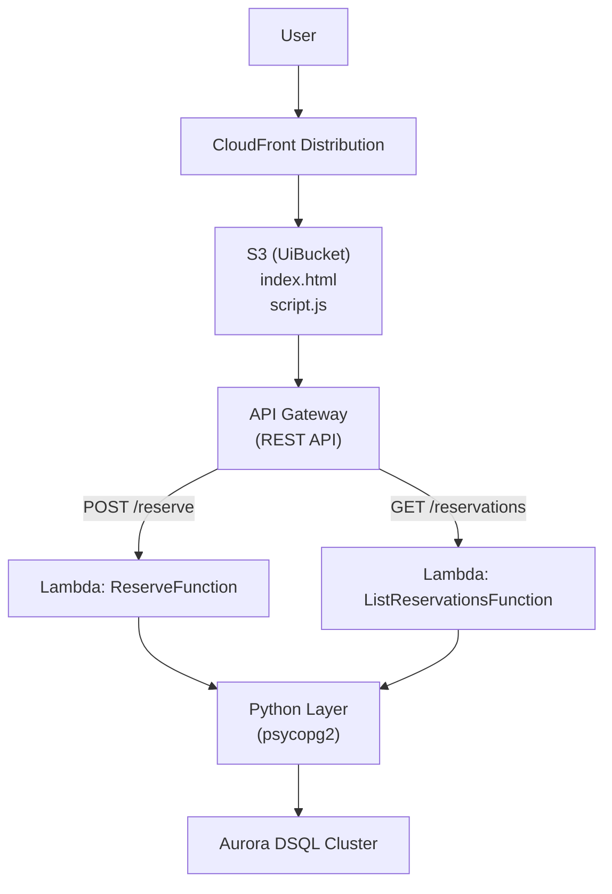

# Web宿泊予約システム デプロイ手順

## 構成

### 構成図



### ファイル構成

```
dsql-reservation/
├── README.md
├── frontend
│   ├── config.json
│   ├── index.html
│   └── script.js
├── layers
│   ├── python
│   │   └── requirements.txt
├── setup
│   ├── build-psycopg2-layer.sh
│   ├── create_table.sh
│   ├── create_table.sql
│   └── upload_contents.sh
├── src
│   ├── db.py
│   └── handlers
│       ├── list_reservations.py
│       └── reserve.py
└── template.yaml
```

---

## デプロイ手順（SAM）

### 1. psycopg2レイヤーの作成

`bash setup/build-psycopg2-layer.sh`

### 2. デプロイ

```bash
aws s3 mb s3://aws-sam-cli-managed-default-YOUR_AWS_ACCOUNT
cd dsql-reservation
sam validate
sam build
sam deploy \
  --stack-name dsql-reservation-system \
  --s3-bucket aws-sam-cli-managed-default-YOUR_AWS_ACCOUNT \
  --capabilities CAPABILITY_NAMED_IAM \
  --parameter-overrides \
    DBHost="YOUR_DSQL_CLUSTER_PUBLIC_ENDPOINT" \
    DBUser=admin \
    DBName=postgres
```

```
Outputs
-----------------------------------------------------------------------------------------------------------
Key                 ApiUrl
Description         API Gateway base URL
Value               https://xxx.execute-api.ap-northeast-1.amazonaws.com/Prod/

Key                 ListReservationsFunctionEndpoint
Description         GET endpoint to list reservations
Value               https://xxx.execute-api.ap-northeast-1.amazonaws.com/Prod/reservations

Key                 ReserveFunctionEndpoint
Description         POST endpoint to make reservation
Value               https://xxx.execute-api.ap-northeast-1.amazonaws.com/Prod/reserve


```

### 3. DSQLクラスターの作成

- 2027/07/23現在、AWS SAMがDSQLに未対応のため、手動でデプロイして下さい
- SAM CLI, version 1.142.1

### 4. DB用初期テーブルの作成

```bash
psql --username admin --host DSQLパブリックエンドポイント --dbname postgres -f setup/create_table.sql
```

- usernameはadmin固定  
- dbnameもpostgres固定

---

### 5. フロントエンド公開

```bash
bash setup/upload_contents.sh
```

---

## 動作確認

1. UIアクセス
2. フォームから予約
3. 「予約されました」が表示され、下部の履歴が更新される

## 仕様

- 予約日が同じ場合、登録が拒否されます
- 名前1文字につき1秒がトランザクション処理時に加算されます

## 注意

- 予約リストAPI(reservations)は公開されるため直接API URLにアクセスすると予約一覧が表示されます
