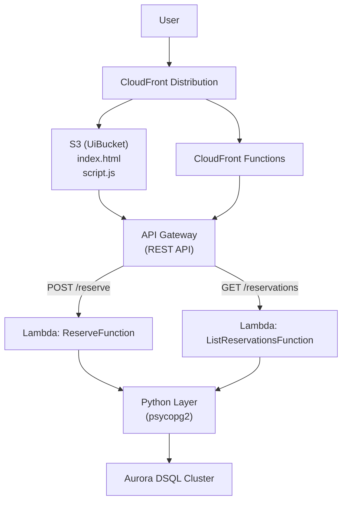

# Web宿泊予約システム デプロイ手順

## 構成

### 構成図



### ファイル構成

```
dsql-reservation/
├── README.md
├── frontend
│   ├── config.json
│   ├── index.html
│   └── script.js
├── layers
│   ├── python
│   │   └── requirements.txt
├── setup
│   ├── build-psycopg2-layer.sh
│   ├── create_table.sh
│   ├── create_table.sql
│   └── upload_contents.sh
├── src
│   ├── db.py
│   └── handlers
│       ├── list_reservations.py
│       └── reserve.py
└── template.yaml
```

---

## 🔧 事前準備

1. psycopg2 layerのビルド
2. SAMの実行
3. DB用初期テーブルの作成

---

## デプロイ手順（SAM）

### 1. psycopg2レイヤーの作成

`bash setup/build-psycopg2-layer.sh`

### 2. デプロイ

```bash
cd dsql-reservation
sam validate
sam build
```

```bash
sam deploy \
  --stack-name dsql-reservation-system \
  --resolve-s3 \
  --capabilities CAPABILITY_IAM \
  --parameter-overrides \
    DBUser=admin \
    DBName=postgres \
```

### 3. DB用初期テーブルの作成

```bash
psql --username admin --host DSQLパブリックエンドポイント --dbname postgres -f setup/create_table.sql
```

- usernameはadmin固定  
- dbnameもpostgres固定

---

### 4. フロントエンド公開

```bash
bash setup/upload_contents.sh
```

---

## 動作確認

1. UIアクセス
2. フォームから予約
3. 「予約されました」が表示され、下部の履歴が更新される

## 制限

- 予約日が同じ場合、登録が拒否されます

## 注意

- 予約リストAPI(reservations)は公開されいて直接API URLにアクセスすると予約一覧が表示されます
- 通常は予約処理完了後、CloudFront Functionsにより、一覧を取得し表示する処理です
